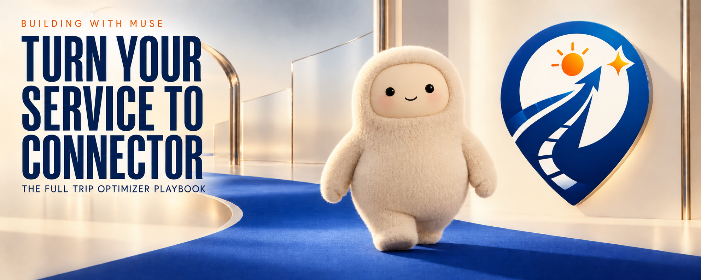

# trip-optimizer-muse

The Muse skill for Trip Optimizer: plan and optimize trips with the autoresearch pattern.

## Architecture

**The agent is the LLM provider.** All judgment — proposal generation, Q&A, 3-pass scoring, research synthesis, rubric generation, debrief summarization — is done natively by the agent. The hosted service ([trip-optimizer-service](https://github.com/michaelpersonal/trip-optimizer-service)) holds only deterministic state: the trip registry and per-trip git repos (`plan.json`, `plan.md`, `constraints.yaml`, `rubrics.yaml`, `activities_db.json`, `proposals/`, append-only run log).

## Layout

- `SKILL.md` — the skill: workflows (init, research, run, score, ask, propose/apply/reject, reoptimize, debrief) and operating rules.
- `bin/trip.py` — thin CLI over the hosted API, authenticated via the `custom.trip-optimizer` connector (API key in Bearer header, exchanged through authd; never printed or persisted).
- `references/` — the behavioral contract ported from the trip-optimizer engine: data model, scoring methodology, run loop, proposal lifecycle.

## Key invariants

- Proposals are never auto-applied; apply only on explicit user approval.
- Applying a stale proposal returns `PROPOSAL_CONFLICT` — regenerate, never force.
- `plan.md` stays synchronized with `plan.json` after every apply.
- The run log is append-only; it is the crash-recovery source of truth.
